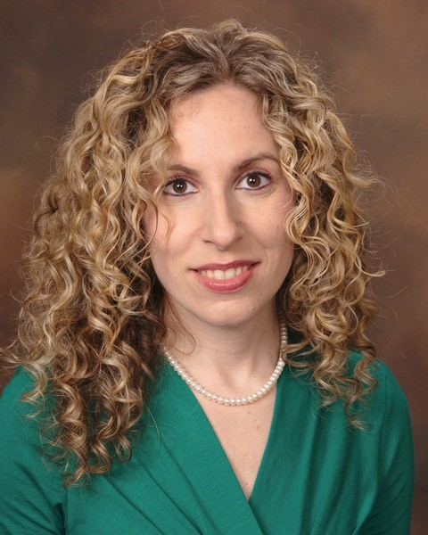
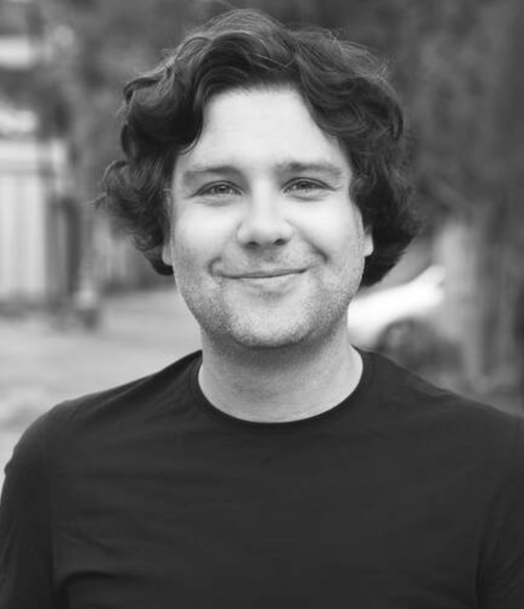

The executive council is comprised of 7 members. At least one member must represent Canada. North American Chapter members can be elected every-other-year to the Executive Council via electronic elections.

<br>

The following people serve on the seven-member Executive Council of the ISEE North American Chapter:

<br>

# Jessie Buckley, Co-Chair

<p align = "center">
 
</p>

[Jessie Buckley](https://sph.unc.edu/adv_profile/jessie-p-buckley/){target="_blank"}, PhD, is an Epidemiology at the Gillings School of Global Public Health, University of North Carolina. Her major research areas include identifying sources of chemical exposures, estimating effects of exposure mixtures, and assessing environmental influences on children’s development including bone health and obesity. Dr. Buckley is director of chemical exposure methodology for the Data Analysis Center of the NIH’s Environmental influences on Child Health Outcomes (ECHO) Program, where she oversees data harmonization and pooled analyses of chemical exposures and children’s health.

<br>

***

<br>

# Shohreh Farzan, Co-Chair

<p align = "center">
 
</p> 

[Shohreh Farzan](https://keck.usc.edu/faculty-search/shohreh-f-farzan/){target="_blank"}, PhD, is Assistant Professor of Population and Public Health Sciences at the Keck School of Medicine of USC. Dr. Farzan’s research focuses on the impact of environmental contaminants on maternal-child health, with a special interest in cardiometabolic health. Much of Dr. Farzan’s work focuses on the role of environmental exposures in altering preclinical indicators of cardiovascular and metabolic disease risk, particularly during vulnerable lifestages, such as childhood and pregnancy. Within the Maternal and Developmental Risks of Environmental and Social Stressors (MADRES) study, a NIMHD-funded Center of Excellence on Environmental Health Disparities Research, she focuses on the role of prenatal air pollutants and psychosocial stressors on maternal postpartum cardiometabolic health.

<br>

***

<br>

# Aisha Dickerson

<p align = "center">
 
</p>

[Aisha Dickerson](https://publichealth.jhu.edu/faculty/3898/aisha-s-dickerson){target="_blank"}, PhD, is Assistant Professor of Epidemiology at the Johns Hopkins Bloomberg School of Public Health. Her research evaluates the impact of environmental exposures on neurodevelopmental and neurodegenerative disorders, with a focus on underserved communities.

<br>

***

<br>

# Stephanie Eick

<p align = "center">
 
</p>

[Stephanie Eick](https://sph.emory.edu/faculty/profile/index.php?FID=stephanie-eick-12810){target="_blank"}, PhD, is an Assistant Professor of Environmental Health and Epidemiology (joint) at the Rollins School of Public Health, Emory University. Her research focuses on the health effects of environmental chemical and non-chemical (i.e., psychosocial) stressors during pregnancy. She has a particular interest in chemical mixtures, as well as understanding how non-chemical stressors can amplify the harmful effects of chemicals. She is also interested biomarkers of stress response, such as oxidative stress and inflammation, and better understanding the biological mechanisms leading to adverse pregnancy and child health outcomes. Her research has been funded by the Eunice Kennedy Shriver National Institute of Child Health and Human Development (NICHD) and the National Institute of Environmental Health Sciences (NIEHS). Dr. Eick is also a member of the Scientific Advisory Committee on Chemicals, which provides independent scientific advice, information and recommendation to the United States Environmental Protection Agency (US EPA). Prior to joining Emory, Dr. Eick was a postdoctoral scholar at the University of California, San Francisco with the Program on Reproductive Health and the Environment. She is involved with multiple ongoing, prospective birth cohorts.  

<br>

***

<br>

# Jaime Madrigano

<p align = "center">
 
</p>

[Jaime Madrigano](https://publichealth.jhu.edu/faculty/4342/jaime-madrigano){target="_blank"}, ScD, is an environmental epidemiologist and Associate Professor at the Johns Hopkins Bloomberg School of Public Health. Her research focuses on environmental and social determinants of health, including air pollution, neighborhood environments, and extreme weather and disasters. Prior to joining Johns Hopkins, she was an environmental epidemiologist and policy researcher at the RAND Corporation, an Assistant Professor at Rutgers University, and an Earth Institute Fellow at Columbia University. Dr. Madrigano received her Sc.D. in epidemiology and environmental health from the Harvard T.H. Chan School of Public Health.

<br>

***

# Scott Weichenthal

<p align = "center">

</p>

[Scott Weichenthal](https://scottweichenthal.weebly.com){target="_blank"}, PhD, is an Associate Professor in the Department of  Epidemiology and Biostatistics at McGill University in Montreal, Canada. His research program is dedicated to identifying and evaluating environmental risk factors for chronic illnesses such as cancer and cardiovascular disease. To support this objective, Dr. Weichenthal develops new approaches to population-based exposure assessment and examines how the urban built environment influences environmental exposures at both the individual and population-level. His past studies have examined the health effects of air pollution from biomass burning, traffic (e.g., ultrafine particles), as well as the oxidative potential of fine particulate air pollution (PM2.5). His current research also examines the use of deep learning models in estimating environmental exposures using images and audio data. 

<br>

***

<br>

# Alexandra White

<p align = "center">
 
</p>

[Alexandra White](https://www.niehs.nih.gov/research/atniehs/labs/epi/pi/cancer){target="_blank"}, PhD, leads the Environment and Cancer Epidemiology group. The overarching research goal for the group is to identify novel and modifiable environmental exposures that are related to women’s cancer risk and to explore underlying biologic mechanisms. Given the high incidence of breast cancer and the widespread prevalence of environmental exposures, her research has the potential to have a substantial public health impact. With the long-term goal of reducing the incidence of cancer in women, she aims to identify environmental carcinogens for which exposure can be mitigated either with policy changes or individual-level interventions. Dr. White’s work leverages the resources of the Sister Study prospective cohort, which aims to identify environmental risk factors for cancer. Recent findings have supported a role for exposure to indoor and outdoor air pollutants, and use of chemical hair products and other environmental exposures in relation to breast cancer risk. A key aspect of this research has been characterizing how suspected environmental risk factors for breast cancer are related to both biological and clinical markers relevant for cancer etiology, including epigenetics and breast tissue characteristics. Using data from the NCI-funded Breast Cancer Surveillance Consortium and the Komen Tissue Bank, findings have suggested that exposure to air pollution may be related to changes in the breast tissue that increase a woman’s susceptibility to developing breast cancer.

<br>

***

<br>

# Former Councilors
<br>
###Kate Weinberger, 2021 -- 2023
### [Carrie Breton](https://keck.usc.edu/faculty-search/carrie-breton/){target="_blank"}, 2021 -- 2023
### [Joan Casey](https://deohs.washington.edu/faculty/joan-casey){target="_blank"}, 2020 -- 2022
### [Marianthi-Anna Kioumourtzoglou](https://www.publichealth.columbia.edu/people/our-faculty/mk3961){target="_blank"}, 2020 -- 2022
### [Joel Schwartz](https://www.hsph.harvard.edu/joel-schwartz/){target="_blank"}, 2020 -- 2022
### [Patrick Kinney](https://www.bu.edu/sph/profile/patrick-kinney/){target="_blank"}, 2019 -- 2020
### [Francine Laden](https://www.hsph.harvard.edu/francine-laden/){target="_blank"}, 2019 -- 2020
### [Paul Villeneuve](https://carleton.ca/eoel/){target="_blank"}, 2019 -- 2021
### [Tracey Woodruff](https://prhe.ucsf.edu/faculty-staff){target="_blank"}, 2019 -- 2021

<!-- ```{r setup, include=FALSE} -->
<!-- htmltools::tagList(rmarkdown::html_dependency_font_awesome()) -->
<!-- ``` -->

<!-- <div class="expand collapsed" data-toggle="collapse" data-target="#pastmembers" aria-expanded="false" aria-controls="pastmembers"> -->
<!-- # Former Councilors <i class="fa fa-angle-double-down"></i> -->
<!-- </div> -->

<!-- <div class="collapse" id="pastmembers"> -->
<!-- <br> -->

<!-- ### [Patrick Kinney](https://www.bu.edu/sph/profile/patrick-kinney/){target="_blank"}, 2019 -- 2020 -->
<!-- ### [Francine Laden](https://www.hsph.harvard.edu/francine-laden/){target="_blank"}, 2019 -- 2020 -->

<!-- </div> -->
