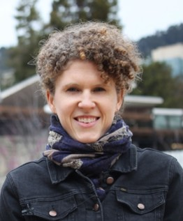
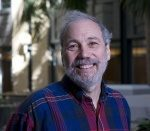
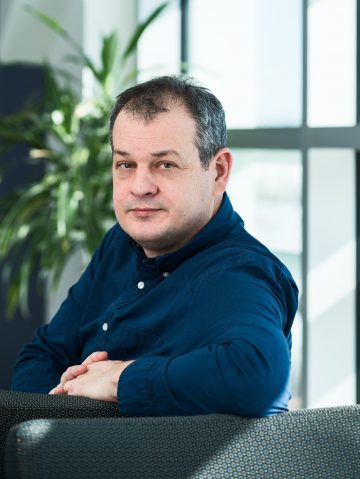

The executive council is comprised of 7 members. At least one member must represent Canada. North American Chapter members can be elected every-other-year to the Executive Council via electronic elections.

 

The following people serve on the seven-member Executive Council of the ISEE North American Chapter:

 

# Joan Casey, Co-Chair

 

[Joan Casey](https://www.mailman.columbia.edu/people/our-faculty/jac2250){target="_blank"}, PhD, received her doctoral degree from the Department of Environmental Health Sciences at Johns Hopkins Bloomberg School of Public Health in 2014. Dr. Casey is an environmental epidemiologist who focuses on environmental health, environmental justice, and sustainability. Her research uses electronic health records and spatial statistics to study the relationship between emerging environmental exposures and population health. She also considers vulnerable populations and the implications of health disparities, particularly in an era of climate change. Dr. Casey investigates a range of exposures including unconventional natural gas and oil development, coal-fired power plants, and concentrated animal feeding operations. Dr. Casey also holds a BS in Biological and Environmental Engineering from Cornell University and an MA in Applied Physiology from Teachers College at Columbia University.
 

***

# Marianthi-Anna Kioumourtzoglou, Co-Chair

 

 

[Marianthi-Anna Kioumourtzoglou](https://www.publichealth.columbia.edu/people/our-faculty/mk3961){target="_blank"}, ScD, MSPH, is an environmental engineer and epidemiologist. She holds a Master of Science in Public Health (MSPH) from the Environmental Sciences and Engineering Department at the University of North Carolina at Chapel Hill and a Doctor of Science (ScD) in Environmental Health from the Harvard TH Chan School of Public Health, where she also conducted her post-doctoral fellowship. She is currently an Assistant Professor at the Department of Environmental Health Sciences at Columbia University's Mailman School of Public Health. Her research focuses on applied statistical issues related to environmental epidemiology, including quantifying and correcting for exposure measurement error, exposure prediction uncertainty propagation, and assessment of high-dimensional and complex exposures in health analyses. Her studies mainly (albeit not exclusively) focus on air pollution exposures and, additionally, on identifying vulnerable sub-populations and characterizing how risks may vary across neighborhood-level and other urban characteristics, as well as in a changing climate.

 

***

 

# Patrick Kinney 

 

[Patrick Kinney](https://www.bu.edu/sph/profile/patrick-kinney/){target="_blank"}, PhD, joined the School of Public Health faculty in January 2017 as the inaugural Beverly Brown Professor of Urban Health. He was trained as an air pollution epidemiologist at Harvard School of Public Health, and came to BU after two decades at the Columbia University Mailman School of Public Health. In his time at Columbia, he showed how warming temperatures make air pollution like urban smog worse, and more harmful to populations. He led the development of an integrated modeling system to predict the air pollution health effects of climate change into the future. Working at the intersection of climate change, health, and policy, Kinney has conducted research from the South Bronx to China to rapidly growing cities throughout Africa. At Columbia, he also created an interdisciplinary research and teaching program examining the potential impacts of climate change on health. At BU, Kinney is developing a new program that focuses on assessing the health benefits of urban climate action plans, via strategies to promote active transport, green infrastructure, and clean vehicles.
 

***

 

# Francine Laden

 

[Francine Laden](https://www.hsph.harvard.edu/francine-laden/){target="_blank"}, ScD, MS, is Professor of Environmental Epidemiology at the Harvard T.H. Chan School of Public Health, and an Associate Professor of Medicine at the Harvard Medical School and the Brigham & Women’s Hospital. Dr. Laden received her ScD in Epidemiology and MS in Environmental Health from the Harvard School of Public Health. Her research interests focus on the environmental epidemiology of chronic diseases, including cancer, respiratory and cardiovascular disease. Her research has or is concentrated on the following categories of exposures: air pollution (from ambient and occupational sources), persistent organic pollutants (POPs; organochlorines), secondhand smoke, and the contextual environment (e.g. built environment and green spaces). She is specifically interested in the geographic distribution of disease risk, incorporating geographic information system technology into large cohort studies to explore risk factors such as the built environment and indicators of socioeconomic status, as well as air pollution. She has published key papers on the association of ambient particulate matter and all cause and cardiovascular mortality in the landmark Harvard Six Cities Study and the Nurses’ Health Study and on the association of diesel exhaust exposures and lung cancer mortality in the trucking industry.
 

***

 

# Joel Schwartz

 

[Joel Schwartz](https://www.hsph.harvard.edu/joel-schwartz/){target="_blank"}, PhD, is a Professor of Epidemiology at the Harvard T.H. Chan School of Public Health. Joel's research is divided in three main areas: First, he is interested in epidemiology looking at the health consequences of exposure to pollutants. To date this has had two focuses: health effects of lead and health effects of air pollutants. He has recently begun work looking at water contamination. Second, Joel is also interested in methodological questions regarding the modeling of continuous covariates in epidemiologic studies, both for better covariate control and to more accurately assess the relationship between exposure and response. This has involved regression spline models, nonparametric smoothing, and generalized additive models. Joel has been using mixed and hierarchical models to combine this information across studies. Case-crossover techniques have also been introduced for these purposes. He has demonstrated the effectiveness of these tools in applications in both lead and air pollution studies. He has also been interested in issues involving time series studies, where the outcomes measures are not independent. This has involved generalized least squares and generalized estimating equation approaches. Third, Joel's research has focused on the effects of antioxidants on respiratory health. To date, this has focused on chronic effects (e.g. relationship between dietary intake and level of pulmonary function or symptoms), but future research will examine their potential to modify acute responses as well.

 

***

 

# Paul Villeneuve

 

[Paul Villeneuve](https://carleton.ca/eoel/){target="_blank"}, PhD, is currently a Professor in the School of Mathematics and Statistics, while holding appointments in the Department of Health Sciences and in the Departments of Health Sciences and Neurosciences at Carleton University. He is also an Affiliate Scientist at the Ontario Occupational Cancer Research Centre in Toronto, and an Associate Editor for the journal Environmental and Occupational Medicine. Paul continues to serve as an on the Advisory Committee for the Canadian Health Adaptations, Innovations, and Mobilization (CHAIM) Centre at Carleton. Paul's research focuses on investigating the associations between environmental and occupational exposures and a number of adverse health outcomes. Specific projects include evaluating the impacts of long-term exposure to air pollution and the risk of chronic diseases such as cancer, diabetes and dementia. Paul also studies the health benefits of urban greenness which include how these features of the built environment help promote physical activity, and reduce the risk of mortality, and adverse birth outcomes. Paul's research activities have also investigated the impacts of urban greenness in reducing harmful exposures of air pollution, noise, and urban heat island. He is currently leading a study that is characterizing the risk of lung cancer in a cohort of Newfoundland miners who were occupationally exposed to radon.
 

***

 

# Tracey Woodruff

 

[Tracey Woodruff](https://prhe.ucsf.edu/faculty-staff){target="_blank"}, PhD, MPH, is the Director of and Alison S. Carlson Endowed Professor for PRHE and is a Professor in the UCSF Department of Obstetrics, Gynecology and Reproductive Sciences and the Philip R. Lee Institute for Health Policy Studies. She is a recognized expert on environmental pollution exposures and impacts on health, with a focus on pregnancy, infancy and childhood, and her innovations in translating and communicating scientific findings for clinical and policy audiences. She has authored numerous scientific publications and book chapters, and has been quoted widely in the press, including USA Today, the San Francisco Chronicle and The New York Times. Before joining UCSF, Dr. Woodruff was a senior scientist and policy advisor for the U.S. EPA's Office of Policy. She is an Associate Editor of Environmental Health Perspectives. She was appointed by the governor of California in 2012 to the Science Advisory Board of the Developmental and Reproductive Toxicant (DART) Identification Committee.
 
