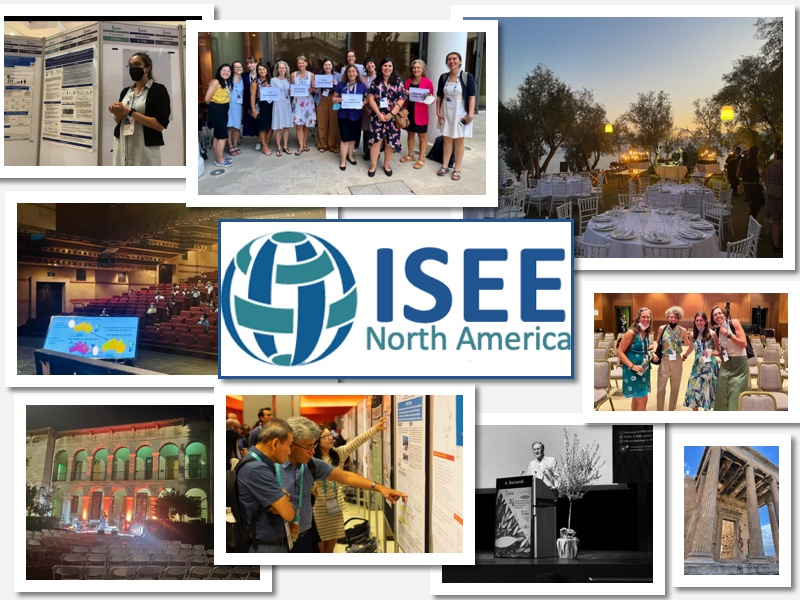

 

 

***
The North America Chapter (NAC) was established by the ISEE Council in January, 2019. Its mission is to promote and strengthen scientific research in environmental epidemiology, with a focus on the countries within this region, considering the wide range of issues that are both specific to them, and similar to those faced by ISEE worldwide. As this is a critical time in terms of environmental policies for North America, the role of this chapter will be to communicate with, and coordinate and concentrate, the efforts and actions of members.The NAC consists of the United States, Canada, Greenland, and Bermuda.

 

<video width="640" height="480" controls>
  <source src="images/ISEE_NAC-conf_recap-03.mp4" type="video/mp4">
</video>

 

The NAC will support the mission of the ISEE by:

* Promoting scientific research on environmental health, especially environmental epidemiology;
* Encouraging the collaboration of researchers between institutions within the region;
* Engaging in education, training, and career development in environmental epidemiology;
* Bridging the gap between the discoveries of research and translation into public health policy.

Emphasis will be on civic engagement regarding policy in Canada and the United States.

 

 ***

#### BYLAWS

ISEE NAC Bylaws can be accessed [here](Downloads/bylaws.pdf).

 

#### ACTION PLAN

ISEE NAC Action Plan can be accessed [here](Downloads/ActionPlan_ISEE_NorthAmerica.pdf).

***

#### Other ISEE-related links

Follow us on Twitter [\@ISEE_NAC](https://twitter.com/isee_nac?lang=en){target="_blank"}! 

 

##### ISEE Global

The ISEE main website can be found [here](https://www.iseepi.org/){target="_blank"}.
 
Follow the ISEE on Twitter [\@ISEE_global](https://twitter.com/isee_global/){target="_blank"}. 

 

##### ISEE Chapters

More information regarding all ISEE Chapters can be found [here](https://www.iseepi.org/Public/Chapters/Public/Regional_Chapters/Chapter_Information.aspx?hkey=f7344997-0fee-4ac4-8241-a97281da8dcc){target="_blank"}.
 
The ISEE Asia Chapter website can be found [here](http://isee-ac.hct.tw/){target="_blank"}.
 
The ISEE Europe Chapter website can be found [here](http://www.isee-europe.com/){target="_blank"}.

 

##### Student and New Researchers Network (SNRN)

Information regarding the SNRN can be found [here](https://www.iseepi.org/Public/About_Us/Committees/SNRN%20Network/Public/About_Us/ISEE_Committees/Students_and_New_Researchers_Network.aspx?hkey=be7ae2aa-a2e2-42b2-9d7b-be13e6208ece){target="_blank"}.
 
Follow the SNRN on Twitter [\@ISEESNRN](https://twitter.com/iseesnrn?lang=en){target="_blank"}. 

 

##### ISEE Job Postings

Information regarding ISEE job postings can be found [here](https://www.iseepi.org/Public/Public/Career_Development/View_Job_Postings.aspx){target="_blank"}. 

 
 
 
 
 
 
 

 ***
 
 **Copyright © 2019 ISEE NAC.**      Website designed by Ahlam Abuawad.       _Website last updated: `r format(Sys.Date(), "%m.%d.%Y")`_

