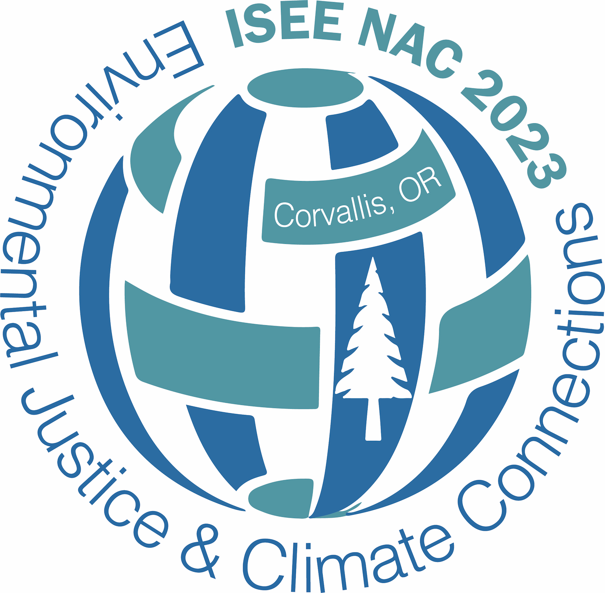

 

  Join us in beautiful Corvallis, OR (06.19-21.2023) for ISEE NAC's first-ever meeting! Please visit our [conference website](https://iseenac2023.org){target="_blank"} to learn more, including details on our exciting upcoming programming and how to register!!! We hope to see you there!!

 

 

<!--   -->

<!-- The 32nd Annual Conference of the International Society for Environmental Epidemiology (ISEE), hosted by the [George Washington University (GW)](https://www.gwu.edu/){target="_blank"}, is expected to attract more than 1,200 participants from around the globe and aims to support ISEE’s intent to positively impact quality research, training and policy worldwide. The program chairs selected the theme “Advancing Environmental Health in a Changing World” to heighten the importance of translating human environmental health science into action amid global changes in climate, geopolitics, and demographics. -->

<!-- As the capital city of the United States, the Washington, DC, area is home to a wide range of environmental epidemiologists working in a rich array of settings - academic, governmental, international multilateral organizations, consulting firms and think tanks, nonprofits, and private sector institutions. Washington, DC, is uniquely situated as a backdrop for this purpose and brings a rich diversity of scientists and policymakers who are working in environmental health at the local, state, federal and international level. The city is known as one of the most walkable and leads the country in several environmental and sustainability initiatives with an emphasis on smart cities, climate resiliency, and urban agriculture. It is an important multiethnic and multicultural environment, where people from all nationalities converge and interact. From iconic monuments to vibrant neighborhoods filled with character and charm, Washington, DC, offers unique cultural diversity, pairing its international influence with a distinct and local identity. -->

<!--   -->

***

Information regarding past and future ISEE Global Meetings can be found [here](https://www.iseepi.org/Public/Annual_Meeting/Future_Meetings/Public/Annual_Meetings/Future_Meetings.aspx?hkey=6ac6ca51-7884-42c5-a6a0-c3811b8602ff){target="_blank"}.

 
