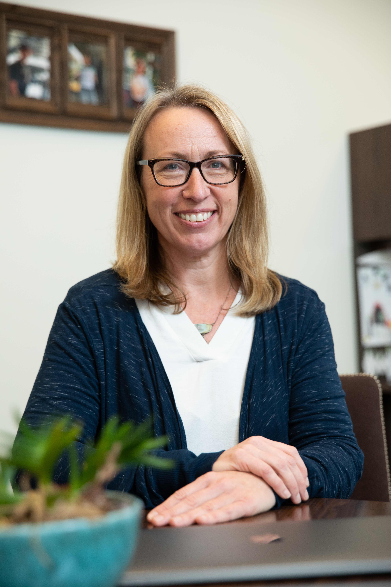

 

# Carrie Breton, Chair

[Carrie Breton](https://keck.usc.edu/faculty-search/carrie-breton/){target="_blank"}, ScD, is Professor of Population and Public Health Sciences at the Keck School of Medicine of USC. The overarching goals of her research program are to understand how environmental exposures early in life contribute to the increased risk of disease later in life, as well as the role genetic and epigenetic mechanisms play in driving observed associations. Despite evidence from animal models supporting a developmental origins of adult disease hypothesis (DOHad), which proposes that adverse events during early life program an increased risk for numerous adult diseases, human studies of in utero or childhood environmental exposures have not been a primary focus until recently. Her work in evaluating prenatal air pollution and prenatal tobacco smoke exposures provides evidence that early life exposures are important risk factors for cardio-respiratory health in children and young adults.

 

***

 

# Sara Adar

 

[Sara Adar](https://sph.umich.edu/faculty-profiles/adar-sara.html){target="_blank"}, ScD, is an Associate Professor of Epidemiology at the University of Michigan. Her research focuses on the human health effects of air pollution, with a growing interest in identifying intervention strategies reduce exposures and improve health. Dr. Adar has served as an expert panelist for the Environmental Protection Agency and World Health Organization, including participation in the development of the National Ambient Air Quality Standards for particulate matter and sulfur oxides. She has also received the Sandra A. Daugherty Award for Excellence in Cardiovascular Epidemiology from the American Heart Association and the Excellence in Teaching Award from the University of Michigan School of Public Health. Dr. Adar started her career with an environmental engineering degree from MIT and then moved into Public Health, earning a masters from Johns Hopkins School of Public Health and a doctorate from the Harvard School of Public Health.  

 

***

 

# Francine Laden

[Francine Laden](https://www.hsph.harvard.edu/francine-laden/){target="_blank"}, ScD, MS, is Professor of Environmental Epidemiology at the Harvard T.H. Chan School of Public Health, and an Associate Professor of Medicine at the Harvard Medical School and the Brigham & Women’s Hospital. Dr. Laden received her ScD in Epidemiology and MS in Environmental Health from the Harvard School of Public Health. Her research interests focus on the environmental epidemiology of chronic diseases, including cancer, respiratory and cardiovascular disease. Her research has or is concentrated on the following categories of exposures: air pollution (from ambient and occupational sources), persistent organic pollutants (POPs; organochlorines), secondhand smoke, and the contextual environment (e.g. built environment and green spaces). She is specifically interested in the geographic distribution of disease risk, incorporating geographic information system technology into large cohort studies to explore risk factors such as the built environment and indicators of socioeconomic status, as well as air pollution. She has published key papers on the association of ambient particulate matter and all cause and cardiovascular mortality in the landmark Harvard Six Cities Study and the Nurses’ Health Study and on the association of diesel exhaust exposures and lung cancer mortality in the trucking industry.

 

***

 

# Jaime Madrigano

 

[Jaime Madrigano](https://publichealth.jhu.edu/faculty/4342/jaime-madrigano){target="_blank"}, ScD, is an environmental epidemiologist and Associate Professor at the Johns Hopkins Bloomberg School of Public Health. Her research focuses on environmental and social determinants of health, including air pollution, neighborhood environments, and extreme weather and disasters. Prior to joining Johns Hopkins, she was an environmental epidemiologist and policy researcher at the RAND Corporation, an Assistant Professor at Rutgers University, and an Earth Institute Fellow at Columbia University. Dr. Madrigano received her Sc.D. in epidemiology and environmental health from the Harvard T.H. Chan School of Public Health.    

 

***

 

# Kate Weinberger

 

[Kate Weinberger](https://www.spph.ubc.ca/person/kate-weinberger/){target="_blank"}, PhD, is an Assistant Professor in the School of Population and Public Health at the University of British Columbia. Prior to joining the faculty at UBC in 2019, Dr. Weinberger received a PhD in environmental health sciences from Columbia University and completed her postdoctoral training in environmental epidemiology at the Brown University School of Public Health. Her research focuses on the links between climate change and human health, with current projects examining health outcomes associated with extreme weather events (e.g., heat waves, tropical cyclones) and aeroallergens. Dr. Weinberger also conducts research on the effectiveness of heat adaptation strategies. 

 

***

 

# Mary Willis

 

[Mary Willis](http://www.marydwillis.com/){target="_blank"}, PhD, MPH, holds a joint postdoc appointment in Environmental and Occupational Health at Oregon State University and Epidemiology at Boston University. She is also the Chair of the [SNRN](https://www.iseepi.org/Public/Public/About_Us/ISEE_Committees/Students_and_New_Researchers_Network.aspx){target="_blank"}. 

 

***

 

# Tracey Woodruff

 

[Tracey Woodruff](https://prhe.ucsf.edu/faculty-staff){target="_blank"}, is the Director of and Alison S. Carlson Endowed Professor for PRHE and is a Professor in the UCSF Department of Obstetrics, Gynecology and Reproductive Sciences and the Philip R. Lee Institute for Health Policy Studies. She is also the Director of a newly awarded NIEHS Environmental Health Core Center grant, the Environmental Research and Translation for Health (EaRTH) Center at UCSF. She is a recognized expert on environmental pollution exposures and impacts on health, with a focus on pregnancy, infancy and childhood, and her innovations in translating and communicating scientific findings for clinical and policy audiences. She has authored numerous scientific publications and book chapters, and has been quoted widely in the press, including USA Today, the San Francisco Chronicle and The New York Times. Before joining UCSF, Dr. Woodruff was a senior scientist and policy advisor for the U.S. EPA’s Office of Policy. She was appointed by the governor of California in 2012 to the Science Advisory Board of the Developmental and Reproductive Toxicant (DART) Identification Committee.

 

