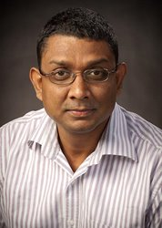
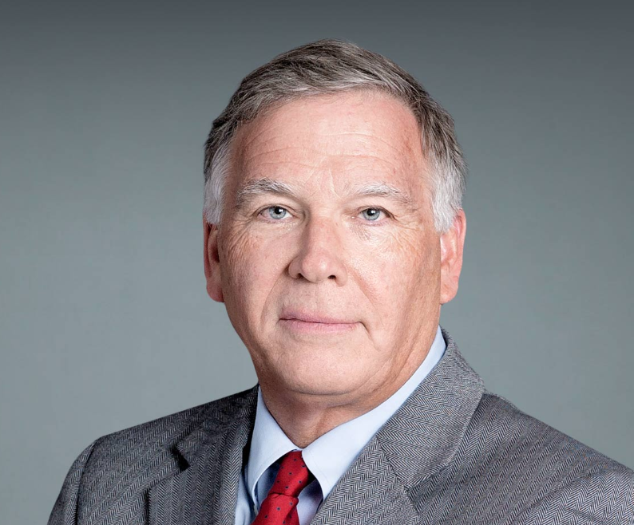

 

# Charlie Roscoe, Co-Chair

 

[Charlie Roscoe](https://www.hsph.harvard.edu/profile/charlie-roscoe/){target="_blank"}, PhD, is an environmental epidemiologist and Postdoctoral Research Fellow at the Dana-Farber Cancer Institute and Harvard T.H. Chan School of Public Health. 

 

***

# Kelvin Fong, Co-Chair

 

[Kelvin Fong](https://kelvinfong.ca/){target="_blank"}, PhD, MSc, is an environmental epidemiologist and Assistant Professor at Dalhousie University. 

 

***

# Abiodun Oluyomi

 

[Abiodun Oluyomi](https://www.bcm.edu/people/view/abiodun-oluyomi-ph-d-m-s/9e7e0972-f9b7-11e6-8210-005056b104be){target="_blank"}, PhD, MS, is an Assistant Professor of Medicine in the Section of Epidemiology and Population Sciences at the Baylor College of Medicine.

 

***

# Atanu Sarkar

 

[Atanu Sarkur](https://www.med.mun.ca/Medicine/Faculty/Sarkar,-Atanu.aspx){target="_blank"}, is an Associate Professor of Environmental and Occupational Health at the Memorial University of Newfoundland. 
 

***

# George Thurston

 

[George Thurston](https://med.nyu.edu/faculty/george-d-thurston){target="_blank"}, ScD, is a Professor of Medicine and Population Health at New York University Grossman School of Medicine. 
 

***

# Paul Villeneuve

 

[Paul Villeneuve](https://carleton.ca/eoel/){target="_blank"}, PhD, is currently a Professor in the School of Mathematics and Statistics, while holding appointments in the Department of Health Sciences and in the Departments of Health Sciences and Neurosciences at Carleton University. 
 
